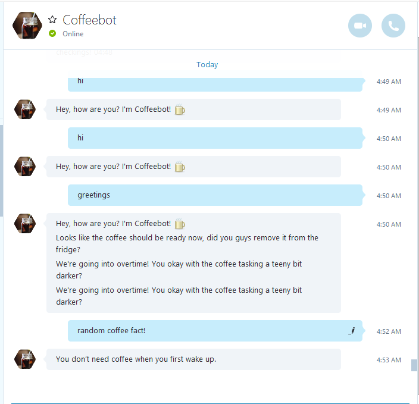

Coffeebot
===
Guided via Usama Tahir's [Medium Article](https://medium.com/@AmJustSam/how-to-build-skype-bot-with-nodejs-ddec8372114c#.ohjeqbprd).  
Built with Microsoft's [Botbuilder](https://github.com/Microsoft/BotBuilder) and [Bot Framework](https://dev.botframework.com/) along with Node.js.

Currently used in Indiepay's Cold Brew Crew chat to keep track of our cold brewing coffee and other coffee-related interests.
